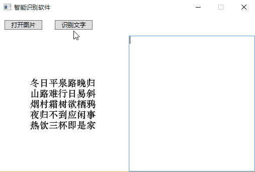

# Tesseract.WpfAppDemo
Tesseract.WpfAppDemo

## 如何开始
- 请用VS2015打开源程序
- 较大的资源需要单独添加进去
    - ORC中文语言包需要手动下载（约40M）[微盘下载 chi_sim.traineddata](http://vdisk.weibo.com/s/C9iEyURSBSqmk)
    - NuGet包管理器添加dll的引用（首次打开会自动加入）

## 知识点：
- 构建基于MVVM的WCF桌面程序。
- 通过多线程分离UI和耗时的操作。
- 采用Tesseract接口实现OCR文字识别。

## 截图
